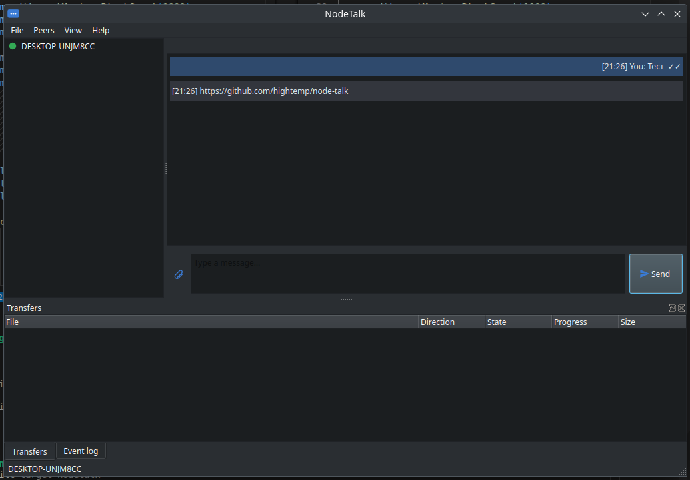
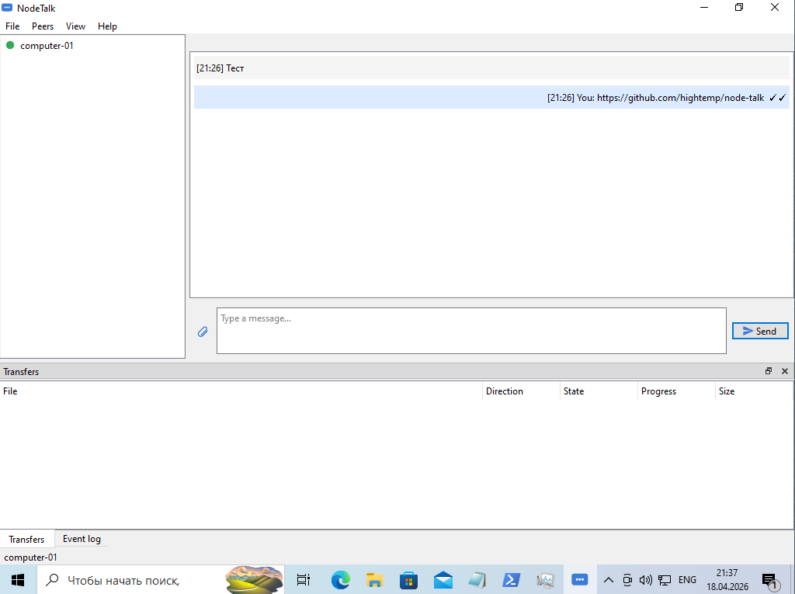

# NodeTalk

[](https://github.com/hightemp/node-talk/actions/workflows/ci.yml)
[](https://github.com/hightemp/node-talk/actions/workflows/release.yml)
[](https://github.com/hightemp/node-talk/releases/latest)
[](LICENSE)
[](https://www.qt.io/)
[](https://en.cppreference.com/w/cpp/17)
[](#releases)

A serverless cross-platform peer-to-peer LAN messenger built with Qt 6
and C++17.

* No central server. Peers discover each other via UDP broadcast +
  multicast on the local subnet (sent on every up, non-loopback IPv4
  interface — works correctly even when a VPN owns the default route).
* Direct LAN TCP transport — never goes through `HTTP_PROXY` /
  `HTTPS_PROXY` even when those env vars are set.
* 1-to-1 chat with delivery / read receipts and typing indicator.
* Resumable file transfer with SHA-256 integrity validation.
* Persistent peer identity (UUID + fingerprint) decoupled from IP.
* Explicit trust UX, per-peer block list, manual add by IP.
* SQLite-backed history, settings, transfers and event log.
* System tray integration with desktop notifications and single-instance
  guard.
* English and Russian UI with **runtime language switching** (no restart).
* Single window UI built with Qt Widgets, palette-aware chat bubbles
  that stay readable on both light and dark system themes.





## Quick start

```bash
git clone https://github.com/hightemp/node-talk.git
cd node-talk
cmake -S . -B build -DCMAKE_BUILD_TYPE=Release
cmake --build build --parallel
./build/NodeTalk
```

Requires **Qt 6.4+** and a C++17 compiler. Detailed instructions per
platform are in [docs/BUILD.md](docs/BUILD.md).

## Documentation

| Document | Subject |
| --- | --- |
| [docs/ARCHITECTURE.md](docs/ARCHITECTURE.md) | High-level module layout |
| [docs/PROTOCOL.md](docs/PROTOCOL.md) | Wire protocol reference |
| [docs/BUILD.md](docs/BUILD.md) | How to build on each OS |
| [docs/PACKAGING.md](docs/PACKAGING.md) | How installers are produced |
| [docs/RELEASE.md](docs/RELEASE.md) | Tagging and publishing releases |
| [docs/TESTING.md](docs/TESTING.md) | Test strategy and how to run them |

## Roadmap

See [TASKS.md](TASKS.md). Milestones M1 (MVP) and M2 (release
pipeline) are complete; M3 (UI polish) is in progress — see the
`Milestone M3 — UI Polish` checklist for individual tasks.

## Releases

Tag a commit with `vX.Y.Z` and the GitHub Release workflow will build
and upload:

* Linux: `.AppImage`, `.tar.gz`, `.deb`
* Windows: portable `.zip` + Inno Setup `.exe` installer
* macOS: zipped `.app` bundle + `.dmg`

Latest builds are on the
[Releases page](https://github.com/hightemp/node-talk/releases).

## License

[MIT](LICENSE)
